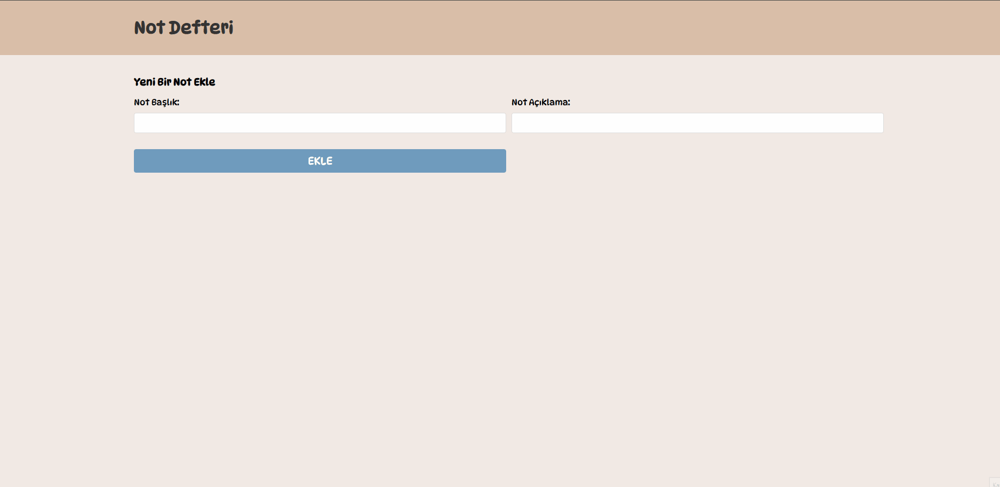

# NoteForm Uygulaması 📝

Bu proje, React kullanarak bir not ekleme formu oluşturur.  
Kullanıcı, not başlığı ve açıklamasını yazarak sisteme ekleyebilir.  

## 🚀 Kullanılan Teknolojiler  
- React.js  
- Fetch API  

## 📸 Görsel Önizleme  
Aşağıda projenin çalışma anını gösteren bir GIF bulunmaktadır:



## 📦 Kurulum  
Projeyi klonladıktan sonra aşağıdaki komutları çalıştırarak bağımlılıkları yükleyin:  

```sh
git clone https://github.com/kullaniciadi/repo-adi.git
cd repo-adi
npm install
npm start
